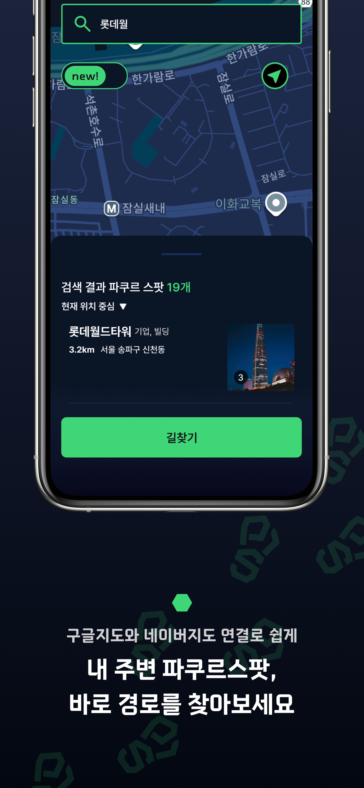
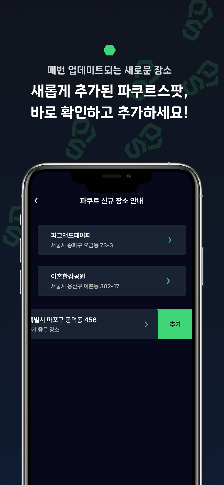

# 🏃‍♂️ Parkour Spot Korea
# 파쿠르 스팟 (parkour spot)
한국의 파쿠르 스팟을 찾고 공유하는 Flutter 앱입니다.


## 스크린샷







## 📱 주요 기능

- **🗺️ 인터랙티브 지도**: Google Maps를 활용한 파쿠르 스팟 탐색
- **📍 스팟 검색**: 위치 기반 파쿠르 스팟 검색 및 필터링
- **⭐ 북마크**: 관심 있는 스팟을 즐겨찾기에 저장
- **👤 사용자 프로필**: Google 로그인 및 개인 프로필 관리
- **🎯 스크래치 맵**: 방문한 스팟을 기록하고 시각화
- **📱 모바일 최적화**: iOS/Android 지원

## 🛠️ 기술 스택

### Frontend
- **Flutter**: 크로스 플랫폼 모바일 앱 개발
- **Dart**: 프로그래밍 언어
- **Provider**: 상태 관리

### Backend & Database
- **Firebase**: 
  - Authentication (Google 로그인)
  - Firestore (클라우드 데이터베이스)
  - Storage (이미지 저장)
  - Remote Config (원격 구성)
- **Drift**: 로컬 SQLite 데이터베이스 ORM

### Maps & Location
- **Google Maps Flutter**: 지도 표시 및 상호작용
- **Geolocator**: GPS 위치 서비스
- **Geocoding**: 주소-좌표 변환
- **GeoJSON**: 지리적 데이터 처리
- **Turf**: 지리적 계산 (point-in-polygon 등)

### UI/UX
- **Material Symbols Icons**: 아이콘
- **Flutter SVG**: SVG 이미지 지원
- **Pretendard**: 한국어 최적화 폰트
- **Custom Themes**: 라이트/다크 테마 지원

### Network & Storage
- **Dio**: HTTP 클라이언트
- **Shared Preferences**: 로컬 설정 저장
- **Path Provider**: 파일 시스템 접근
- **Connectivity Plus**: 네트워크 상태 모니터링

## 🚀 시작하기

### 필수 조건

- Flutter SDK (^3.8.1)
- Dart SDK
- Android Studio / VS Code
- iOS 개발을 위한 Xcode (macOS)

### 설치

1. 저장소 클론
```bash
git clone https://github.com/yourusername/parkourspotkorea.git
cd parkourspotkorea
```

2. 의존성 설치
```bash
flutter pub get
```

3. Firebase 설정
- Firebase 프로젝트 생성
- `google-services.json` (Android) 및 `GoogleService-Info.plist` (iOS) 파일 추가
- Firebase Authentication, Firestore, Storage 서비스 활성화

4. Google Maps API 설정
- Google Cloud Console에서 Maps SDK 활성화
- API 키를 Android/iOS 설정에 추가

5. 앱 실행
```bash
flutter run
```

## 📁 프로젝트 구조

```
lib/
├── core/              # 핵심 설정 및 유틸리티
├── database/          # Drift 데이터베이스 스키마
├── interfaces/        # Repository 인터페이스
├── repositories/      # 데이터 액세스 레이어
├── routes/           # 앱 라우팅 설정
├── screens/          # UI 화면들
│   ├── spot/        # 스팟 관련 화면
│   └── ...
├── services/         # 비즈니스 로직 서비스
├── theme/           # 앱 테마 설정
├── viewmodel/       # MVVM 패턴의 뷰모델
└── main.dart        # 앱 진입점
```

## 🏗️ 아키텍처

이 프로젝트는 **Clean Architecture** 원칙을 따라 설계되었습니다:

- **Presentation Layer**: Flutter Widgets & ViewModels
- **Business Logic Layer**: Repository Interfaces & Services  
- **Data Layer**: Firebase Repositories & Local Database

**상태 관리**: Provider 패턴을 사용하여 반응형 상태 관리를 구현했습니다.

## 🤝 기여하기

1. 이 저장소를 Fork 합니다
2. feature 브랜치를 생성합니다 (`git checkout -b feature/AmazingFeature`)
3. 변경사항을 커밋합니다 (`git commit -m 'Add some AmazingFeature'`)
4. 브랜치에 Push 합니다 (`git push origin feature/AmazingFeature`)
5. Pull Request를 생성합니다

## 📄 라이선스

이 프로젝트는 [MIT 라이선스](LICENSE.md) 하에 배포됩니다.

## 📞 문의

프로젝트에 대한 문의사항이나 제안이 있으시면 이슈를 생성해 주세요.

---

**🏃‍♂️ 파쿠르를 사랑하는 모든 분들을 위해 만들어진 앱입니다!**